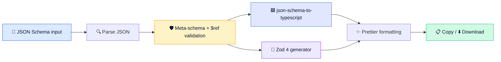

<div align="center">


# JSON Schema → TypeScript & Zod Converter

### Turn any JSON Schema into clean TypeScript types and Zod 4 validation schemas, all inside your browser.

<p>
  <a href="https://himat.tech/free-tools/json-schema-to-typescript-zod-converter">
    
  </a>
  <a href="https://himat.co.in">
    
  </a>
</p>

<p>
  
  
  
  
  
  
  
  
</p>

**🔒 Your schemas stay in your browser. Nothing is uploaded to our servers.**

[Live Demo](https://himat.tech/free-tools/json-schema-to-typescript-zod-converter) ·
[Features](#-features) ·
[Quick Start](#-quick-start) ·
[Supported Keywords](#-supported-json-schema-features) ·
[Contact](#-connect-with-himat-technology)

</div>

---

## ✨ Features

<table>
  <tr>
    <td width="50%" valign="top">

### 🟦 TypeScript output
- Interfaces and type aliases from `json-schema-to-typescript`
- Correct optional `?` and required properties
- `$ref`, `$defs` and `definitions` become named types
- Constraints kept as JSDoc tags (`@minLength`, `@format` …)

</td>
    <td width="50%" valign="top">

### 💎 Zod 4 output
- Named, exported schemas in dependency order
- `z.infer<typeof Schema>` types for every schema
- Recursive refs using Zod 4 getters
- `oneOf` → `z.xor`, formats → `z.email()`, `z.uuid()`, `z.iso.*`

</td>
  </tr>
  <tr>
    <td width="50%" valign="top">

### 🛡️ Validation and diagnostics
- Meta-schema validation for Draft 4, 6, 7, 2019-09 and 2020-12
- JSON errors with line and column, plus "Go to line"
- Missing, external and malformed `$ref` detection
- Unsupported and unknown keywords are reported, never silently dropped

</td>
    <td width="50%" valign="top">

### ⚡ Developer experience
- Live conversion in a Web Worker (the UI never freezes)
- 6 ready-made samples, `.json` upload, drag & drop and paste
- Copy, download `.ts`, or download both as a `.zip`
- Responsive on desktop, tablet and mobile; keyboard accessible

</td>
  </tr>
</table>

---

## 🎬 Example

<table>
<tr>
<th>📥 JSON Schema</th>
<th>📤 Generated Zod</th>
</tr>
<tr>
<td>

```json
{
  "title": "User",
  "type": "object",
  "properties": {
    "id": { "type": "integer" },
    "name": { "type": "string", "minLength": 2 },
    "email": { "type": "string", "format": "email" },
    "isActive": { "type": "boolean" },
    "roles": {
      "type": "array",
      "items": {
        "type": "string",
        "enum": ["admin", "editor", "viewer"]
      }
    }
  },
  "required": ["id", "name", "email"]
}
```

</td>
<td>

```ts
import { z } from "zod";

export const UserSchema = z.object({
  id: z.int(),
  name: z.string().min(2),
  email: z.email(),
  isActive: z.boolean().optional(),
  roles: z
    .array(z.enum(["admin", "editor", "viewer"]))
    .optional(),
});
export type User = z.infer<typeof UserSchema>;
```

</td>
</tr>
</table>

---

## 🚀 Quick Start

> **Requirements:** Node.js 20.9+ and npm

```bash
# 1. Install dependencies
npm install

# 2. Start the dev server
npm run dev
```

Then open 👉 **http://localhost:3000/free-tools/json-schema-to-typescript-zod-converter**

### 📜 Scripts

| Command             | What it does                                   |
| ------------------- | ---------------------------------------------- |
| `npm run dev`       | 🔥 Start the development server                |
| `npm run build`     | 📦 Create a production build                   |
| `npm start`         | ▶️ Serve the production build                  |
| `npm run lint`      | 🧹 Run ESLint                                  |
| `npm run typecheck` | 🔎 Type-check with TypeScript                  |
| `npm test`          | ✅ Run the Vitest suite (conversion + runtime)  |

---

## 🧠 How It Works



Everything runs in a **Web Worker inside your browser**. There are no API routes, no analytics on your content, and no storage of your input.

---

## 📚 Supported JSON Schema Features

| Keyword                                              | 🟦 TypeScript              | 💎 Zod                                         |
| ---------------------------------------------------- | -------------------------- | ---------------------------------------------- |
| `string` `number` `integer` `boolean` `null`         | ✅                         | ✅ (`integer` → `z.int()`)                     |
| `object` `properties` `required`                     | ✅ optional `?`            | ✅ `.optional()`                               |
| `additionalProperties`                               | ✅ index signatures        | ✅ `strictObject` / `looseObject` / `catchall` |
| `array` `items` `prefixItems` `minItems` `maxItems`  | ✅ arrays & tuples         | ✅ `z.array` / `z.tuple`                       |
| `enum` `const`                                       | ✅ literal unions          | ✅ `z.enum` / `z.literal`                      |
| `anyOf` `oneOf` `allOf`                              | ✅ unions / intersections  | ✅ `z.union` / `z.xor` / `.and()`              |
| `$ref` `$defs` `definitions` (incl. recursive)       | ✅ named types             | ✅ named schemas + getters                     |
| `minLength` `maxLength` `pattern` `format`           | 📝 JSDoc tags              | ✅ `.min()` `.max()` `.regex()` `z.email()`…   |
| `minimum` `maximum` `exclusive*` `multipleOf`        | 📝 JSDoc tags              | ✅ `.min()` `.max()` `.gt()` `.lt()`           |
| `uniqueItems` `minProperties` `maxProperties`        | 📝 JSDoc tags              | ✅ `.refine()`                                 |
| `patternProperties`                                  | 🟡 index signatures        | ⚠️ warning                                     |
| `not` `if/then/else` `contains` `dependentSchemas`   | ⚠️ warning                 | ⚠️ warning                                     |
| External / anchor `$ref`                             | ❌ error (offline by design) | ❌ error (offline by design)                 |

---

## 🗂️ Project Structure

```text
app/
└── free-tools/json-schema-to-typescript-zod-converter/page.tsx   # Page, SEO and FAQ
components/
├── tools/json-schema-converter/   # Converter UI (editor, panels, toolbar, diagnostics)
└── ui/                            # Button, SegmentedControl, Checkbox
hooks/                             # Worker-backed converter hook, copy feedback
lib/
├── converters/                    # Parse, validate, TypeScript + Zod generators, samples
└── browser/                       # Clipboard, download, file upload, zip
```

---

## 🤝 Connect with Himat Technology

<div align="center">

<p>
  <a href="https://himat.co.in">
    
  </a>
  <a href="https://www.linkedin.com/company/himat-technology">
    
  </a>
  <a href="https://www.instagram.com/himat_technology">
    
  </a>
  <a href="https://www.facebook.com/people/Himat-technology/61593829197445/">
    
  </a>
</p>

<p>
  <a href="mailto:info@himat.co.in">
    
  </a>
  <a href="tel:+919445234023">
    
  </a>
</p>

| 📍 Location | 📧 Email | 📞 Phone | 🌐 Website |
| :---: | :---: | :---: | :---: |
| Chennai, Tamil Nadu, India | [info@himat.co.in](mailto:info@himat.co.in) | [+91 94452 34023](tel:+919445234023) | [himat.co.in](https://himat.co.in) |

### 🔗 [Try the live demo →](https://himat.tech/free-tools/json-schema-to-typescript-zod-converter)

</div>

---

<div align="center">

📄 Released under the [MIT License](LICENSE)

Made with 💙 by **[Himat Technology](https://himat.co.in)**

</div>
